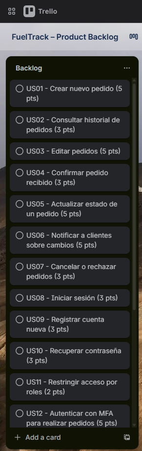

# report

  
  
  <h2>Universidad: Universidad Peruana de Ciencias Aplicadas</h2>
  
<strong>Carrera:</strong> Ingeniería de Software

  
<strong>Ciclo:</strong> 2025-20

  
<strong>Código del Curso y Nombre del Curso:</strong> 1ACC0238-2520-12614 - Aplicaciones para Dispositivos Móviles

  
<strong>Sección:</strong> 12614

  
<strong>Profesor:</strong> David Gerardo Quevedo Velasco

  <h3>Informe de Trabajo Final</h3>

  
<strong>Startup:</strong> FuelTrack

  
<strong>Nombre del Producto:</strong> FuelTrack Pro

<h3 align="center">Relación de Integrantes:</h3>

  <table>
    <tr>
      <th><strong>Apellidos y Nombres</strong></th>
    </tr>
    <tr>
      <td>Juan Carlos Alvarado De La Cruz</td>
    </tr>
    <tr>
      <td>Gianfranco Jared Durand Vega</td>
    </tr>
    <tr>
      <td>Bryan Ronald Espejo Gamarra</td>
    </tr>
    <tr>
      <td>Jhon Danny Guerrero Vasquez</td>
    </tr>
    <tr>
      <td>Renzo Andres Luque Minaya</td>
    </tr>
  </table>

<strong>Mes y Año:</strong> Abril 2025

## Registro de Versiones del Informe

| **Versión** | **Fecha**   | **Autores**                                                                                     | **Descripción de Modificación**                                                                                                                                                                  |
|-------------|-------------|--------------------------------------------------------------------------------------------------|---------------------------------------------------------------------------------------------------------------------------------------------------------------------------------------------------|
| **TB1**     | 26/04/2025  | - Juan Carlos Alvarado De La Cruz   - Gianfranco Jared Durand Vega   - Bryan Ronald Espejo Gamarra   - Jhon Danny Guerrero Vasquez   - Renzo Andres Luque Minaya | Se incluyeron los siguientes capítulos:  • Estructura del informe  • Capítulo I: Presentación  • Capítulo II: Requirements Development & Software Solution Design  • Capítulo III: Solution UI/UX Design  • Capítulo IV: Product Implementation & Validation  • Configuración inicial del repositorio y del Landing Page  • Aplicación de GitFlow y convenciones de commits |
| **TP1**     | --/--/2025  | - Juan Carlos Alvarado De La Cruz   - Gianfranco Jared Durand Vega   - Bryan Ronald Espejo Gamarra   - Jhon Danny Guerrero Vasquez   - Renzo Andres Luque Minaya | *(Pendiente de completar)* |
| **TB2**     | --/--/2025  | - Juan Carlos Alvarado De La Cruz   - Gianfranco Jared Durand Vega   - Bryan Ronald Espejo Gamarra   - Jhon Danny Guerrero Vasquez   - Renzo Andres Luque Minaya | *(Pendiente de completar)* |
| **TF1**     | --/--/2025  | - Juan Carlos Alvarado De La Cruz   - Gianfranco Jared Durand Vega   - Bryan Ronald Espejo Gamarra   - Jhon Danny Guerrero Vasquez   - Renzo Andres Luque Minaya | *(Pendiente de completar)* |

## Project Report Collaboration Insights

Este informe ha sido desarrollado de forma colaborativa mediante GitHub, aplicando GitFlow y Conventional Commits. Cada integrante del equipo ha contribuido mediante ramas independientes, commits individuales y revisiones de Pull Requests.

---

###  Participación por miembro (commits realizados)

A continuación, se muestra un gráfico de barras con la cantidad de commits realizados por cada integrante del equipo:

---

### Evolución temporal de commits

El siguiente gráfico muestra una línea de tiempo con la evolución de los commits realizados por todos los miembros:

---

## Contenido

- [report](#report)
  - [Registro de Versiones del Informe](#registro-de-versiones-del-informe)
  - [Project Report Collaboration Insights](#project-report-collaboration-insights)
    - [Participación por miembro (commits realizados)](#participación-por-miembro-commits-realizados)
    - [Evolución temporal de commits](#evolución-temporal-de-commits)
  - [Contenido](#contenido)
  - [Student Outcome](#student-outcome)
  - [Capítulo I: Introducción](#capítulo-i-introducción)
    - [1.1 Startup Profile](#11-startup-profile)
    - [1.1.1 Descripción de la Startup](#111-descripción-de-la-startup)
      - [1.1.2 Perfiles de integrantes del equipo](#112-perfiles-de-integrantes-del-equipo)
    - [1.2 Solution Profile](#12-solution-profile)
    - [1.2.1 Antecedentes y problemática](#121-antecedentes-y-problemática)
      - [1.2.2 Lean UX Process](#122-lean-ux-process)
      - [1.2.2.1 Lean UX Problem Statements](#1221-lean-ux-problem-statements)
      - [1.2.2.2 Lean UX Assumptions](#1222-lean-ux-assumptions)
        - [1.2.2.3 Lean UX Hypothesis Statements](#1223-lean-ux-hypothesis-statements)
        - [1.2.2.4 Lean UX Canvas](#1224-lean-ux-canvas)
    - [1.3 Segmentos objetivo](#13-segmentos-objetivo)
      - [A. Empresas solicitantes de combustible](#a-empresas-solicitantes-de-combustible)
      - [B. Proveedores de combustible](#b-proveedores-de-combustible)
- [Capítulo II: Requirements Elicitation \& Analysis](#capítulo-ii-requirements-elicitation--analysis)
  - [2.1. Competidores.](#21-competidores)
    - [2.1.1. Análisis competitivo.](#211-análisis-competitivo)
    - [2.1.2. Estrategias y tácticas frente a competidores.](#212-estrategias-y-tácticas-frente-a-competidores)
      - [a. Diferenciación a través de especialización](#a-diferenciación-a-través-de-especialización)
      - [b. Innovación en la interfaz de usuario y experiencia](#b-innovación-en-la-interfaz-de-usuario-y-experiencia)
      - [c. Flexibilidad en precios y modelo SaaS escalable](#c-flexibilidad-en-precios-y-modelo-saas-escalable)
      - [d. Aprovechamiento de la digitalización en la logística](#d-aprovechamiento-de-la-digitalización-en-la-logística)
      - [e. Expansión hacia mercados internacionales](#e-expansión-hacia-mercados-internacionales)
  - [2.2. Entrevistas.](#22-entrevistas)
    - [2.2.1. Diseño de entrevistas.](#221-diseño-de-entrevistas)
      - [A. Proveedores de Combustible](#a-proveedores-de-combustible)
      - [B. Empresas Solicitantes](#b-empresas-solicitantes)
  - [2.3. Needfinding.](#23-needfinding)
    - [2.3.1. User Personas.](#231-user-personas)
    - [2.3.2. User Task Matrix.](#232-user-task-matrix)
    - [2.3.3. User Journey Mapping.](#233-user-journey-mapping)
    - [2.3.4. Empathy Mapping.](#234-empathy-mapping)
    - [2.3.5. Ubiquitous Language.](#235-ubiquitous-language)
  - [2.4. Requirements specification](#24-requirements-specification)
  - [2.4.1. User Stories — Épicas](#241-user-stories--épicas)
  - [2.4.1. User Stories — Funcionales (US\*) y Técnicas (TS\*)](#241-user-stories--funcionales-us-y-técnicas-ts)
    - [2.4.2. Impact Mapping](#242-impact-mapping)
    - [2.4.3. Product Backlog](#243-product-backlog)
  - [2.5. Strategic-Level Domain-Driven Design](#25-strategic-level-domain-driven-design)
    - [2.5.1. EventStorming](#251-eventstorming)
      - [Collect Domain Events](#collect-domain-events)
      - [Refine Domain Events](#refine-domain-events)
      - [Track Causes](#track-causes)
      - [Find aggregates \& re-sort them](#find-aggregates--re-sort-them)
  - 
      - [2.5.1.1. Candidate Context Discovery](#2511-candidate-context-discovery)
      - [2.5.1.2. Domain Message Flows Modeling](#2512-domain-message-flows-modeling)
      - [2.5.1.3. Bounded Context Canvases](#2513-bounded-context-canvases)
    - [2.5.2. Context Mapping](#252-context-mapping)
    - [2.5.3. Software Architecture](#253-software-architecture)
      - [2.5.3.1. Software Architecture Context Level Diagrams](#2531-software-architecture-context-level-diagrams)
      - [2.5.3.2. Software Architecture Container Level Diagrams](#2532-software-architecture-container-level-diagrams)
      - [2.5.3.3. Software Architecture Deployment Diagrams](#2533-software-architecture-deployment-diagrams)
  - [2.6. Tactical-Level Domain-Driven Design](#26-tactical-level-domain-driven-design)
    - [2.6.x. Bounded Context: ](#26x-bounded-context-)
      - [2.6.x.1. Domain Layer](#26x1-domain-layer)
      - [2.6.x.2. Interface Layer](#26x2-interface-layer)
      - [2.6.x.3. Application Layer](#26x3-application-layer)
      - [2.6.x.4. Infrastructure Layer](#26x4-infrastructure-layer)
      - [2.6.x.5. Bounded Context Software Architecture Component Level Diagrams](#26x5-bounded-context-software-architecture-component-level-diagrams)
      - [2.6.x.6. Bounded Context Software Architecture Code Level Diagrams](#26x6-bounded-context-software-architecture-code-level-diagrams)
        - [2.6.x.6.1. Bounded Context Domain Layer Class Diagrams](#26x61-bounded-context-domain-layer-class-diagrams)
        - [2.6.x.6.2. Bounded Context Database Design Diagram](#26x62-bounded-context-database-design-diagram)
- [Capítulo III: Solution UI/UX Design](#capítulo-iii-solution-uiux-design)
  - [3.1. Product Design](#31-product-design)
    - [3.1.1. Style Guidelines](#311-style-guidelines)
      - [3.1.1.1. General Style Guidelines](#3111-general-style-guidelines)
    - [3.1.2. Information Architecture](#312-information-architecture)
      - [3.1.2.1. Organization Systems](#3121-organization-systems)
      - [3.1.2.2. Labelling Systems](#3122-labelling-systems)
      - [3.1.2.3. SEO Tags and Meta Tags](#3123-seo-tags-and-meta-tags)
      - [3.1.2.4. Searching Systems](#3124-searching-systems)
      - [3.1.2.5. Navigation Systems](#3125-navigation-systems)
    - [3.1.3. Landing Page UI Design](#313-landing-page-ui-design)
      - [3.1.3.1. Landing Page Wireframe](#3131-landing-page-wireframe)
      - [3.1.3.2. Landing Page Mock-up](#3132-landing-page-mock-up)
    - [3.1.4. Mobile Applications UX/UI Design](#314-mobile-applications-uxui-design)
      - [3.1.4.1. Mobile Applications Wireframes](#3141-mobile-applications-wireframes)
      - [3.1.4.2. Mobile Applications Wireflow Diagrams](#3142-mobile-applications-wireflow-diagrams)
      - [3.1.4.3. Mobile Applications Mock-ups](#3143-mobile-applications-mock-ups)
      - [3.1.4.4. Mobile Applications User Flow Diagrams](#3144-mobile-applications-user-flow-diagrams)
      - [3.1.4.5. Mobile Applications Prototyping](#3145-mobile-applications-prototyping)

---

## Student Outcome

> *Cada participante del equipo debe colaborar a fin de que se redacte como grupo los sustentos y evidencias de las actividades realizadas en el trabajo final que han ayudado a desarrollar cómo las dimensiones del student outcome. Por ello en esta sección debe quedar descrito por escrito, la relación entre el outcome, sus dimensiones y el trabajo que han realizado.*

| **Criterio Específico** | **Acciones Realizadas** | **Conclusiones**  |
|---|---|---|
| **Actualiza conceptos y conocimientos necesarios para su desarrollo profesional y en especial para su proyecto en soluciones de software** | **Juan Carlos Alvarado De La Cruz** TB1: Coordinó la organización inicial del informe, asegurando que se incluyeran las secciones obligatorias y revisó la estructura base del documento.  **Gianfranco Jared Durand Vega** TB1: Colaboró en la elaboración de la sección de entrevistas y análisis de la problemática inicial, aplicando conceptos revisados en clase.  **Bryan Ronald Espejo Gamarra** TB1: Coordinó el desarrollo del Landing Page, implementando GitFlow y convenciones de commits en el repositorio.  **Jhon Danny Guerrero Vasquez** TB1: Apoyó en la construcción del capítulo de presentación, redactando perfiles de los integrantes y la descripción de la startup.  **Renzo Andres Luque Minaya** TB1: Participó en el diseño de User Personas y en el análisis de los requerimientos iniciales, reforzando los conceptos de UX y Needfinding.   TP1: *(Pendiente de completar)* TB2: *(Pendiente de completar)* TF1: *(Pendiente de completar)* | La aplicación de conceptos vistos en clase permitió establecer una base sólida en la estructuración del informe y el desarrollo del proyecto. |
| **Reconoce la necesidad del aprendizaje permanente para el desempeño profesional y el desarrollo de proyectos en soluciones de software** | **Juan Carlos Alvarado De La Cruz** TB1: Investigó y propuso referencias adicionales para reforzar la parte de antecedentes y problemática.  **Gianfranco Jared Durand Vega** TB1: Complementó la redacción del Lean UX Process con ejemplos investigados de soluciones similares.  **Bryan Ronald Espejo Gamarra** TB1: Aplicó conocimientos previos de control de versiones y metodologías ágiles para estructurar el repositorio y coordinar al equipo.  **Jhon Danny Guerrero Vasquez** TB1: Investigó sobre experiencias de usuario y aportó mejoras en la sección de Empathy Mapping.  **Renzo Andres Luque Minaya** TB1: Se capacitó en herramientas de diseño (Figma/Lucidchart) y aplicó lo aprendido en la construcción de los primeros artefactos visuales.   TP1: *(Pendiente de completar)* TB2: *(Pendiente de completar)* TF1: *(Pendiente de completar)* | El aprendizaje autónomo y continuo de cada miembro permitió enriquecer la propuesta inicial y mejorar la calidad del entregable. |

---

## Capítulo I: Introducción

### 1.1 Startup Profile

### 1.1.1 Descripción de la Startup

**FuelTrack** es una startup innovadora dedicada a la optimización de la gestión de pedidos de combustible entre empresas solicitantes y proveedores. Fundada por estudiantes de la Universidad Peruana de Ciencias Aplicadas (UPC), nuestra propuesta se centra en la digitalización de un sector tradicionalmente dependiente de procesos manuales, brindando una solución tecnológica que garantiza eficiencia, transparencia y un control más riguroso de las operaciones.

**Misión**: Nuestra misión es desarrollar soluciones tecnológicas avanzadas que transformen la gestión de pedidos de combustible, eliminando los métodos informales y reduciendo el margen de error, mediante una plataforma web intuitiva y accesible.

**Visión**: Nuestra visión es posicionarnos como líderes en la digitalización del sector energético, ofreciendo a las empresas una herramienta que facilite una gestión más eficiente, segura y sostenible, contribuyendo al progreso tecnológico y a la mejora de la competitividad del sector.

---
#### 1.1.2 Perfiles de integrantes del equipo

| Foto                                          | Nombre completo               | Código     | Carrera                | Habilidades técnicas y rol                                   |
|-----------------------------------------------|-------------------------------|------------|------------------------|--------------------------------------------------------------|
|              | Juan Carlos Alvarado De La Cruz | U202300101 | Ingeniería de Software | Desarrollo Backend, Gestión de APIs RESTful, Arquitectura DDD |
|  | Gianfranco Jared Durand Vega    | U202300102 | Ingeniería de Software | Desarrollo Frontend (Vue/React), UI/UX, Integración de servicios externos |
|            | Bryan Ronald Espejo Gamarra     | U202213278 | Ingeniería de Software | Backend, Base de Datos, DevOps, Coordinación técnica del proyecto |
|            | Jhon Danny Guerrero Vasquez     | U202300103 | Ingeniería de Software | Desarrollo Móvil Nativo (Kotlin/Swift), Testing y QA          |
|             | Renzo Andres Luque Minaya       | U20221C275 | Ingeniería de Software | Desarrollo Frontend, Cloud Deployment, Seguridad y Autenticación |

### 1.2 Solution Profile

### 1.2.1 Antecedentes y problemática

**Descripción del problema**  
El sector de distribución de combustibles enfrenta serias ineficiencias debido a la dependencia de métodos informales como llamadas telefónicas, correos electrónicos y aplicaciones de mensajería para gestionar los pedidos de combustible. Estos métodos generan desorganización, errores y falta de visibilidad en tiempo real, lo que afecta la eficiencia operativa y la relación con los clientes.

**Técnica 5W+2H**

- **What? (¿Qué?)**  
  La problemática principal es la falta de un sistema centralizado y digital para gestionar los pedidos de combustible, lo que genera errores humanos, duplicación de esfuerzos y retrasos en las entregas.

- **When? (¿Cuándo?)**  
  El problema se presenta constantemente en el proceso de gestión de pedidos, especialmente cuando hay un alto volumen de solicitudes o múltiples pedidos a coordinar.

- **Where? (¿Dónde?)**  
  El problema ocurre en empresas solicitantes de combustible y proveedores, tanto en áreas urbanas como rurales, donde la infraestructura digital aún no está optimizada.

- **Who? (¿Quién?)**  
  Los principales afectados son las empresas solicitantes (medianas y grandes), los proveedores de combustible y los encargados de la logística y gestión de pedidos.

- **Why? (¿Por qué?)**  
  El problema radica en la falta de integración entre los métodos actuales de gestión (como correos y aplicaciones de mensajería), que dificultan un control centralizado y preciso de los pedidos.

- **How? (¿Cómo?)**  
  Los procesos actuales son desorganizados, utilizando diversas plataformas desconectadas, lo que impide tener un flujo de trabajo eficiente y controlado.

- **How Much? (¿Cuánto?)**  
  La magnitud del problema es considerable, pues cada día se pierden horas valiosas debido a la ineficiencia y los errores, lo que incrementa los costos operativos y puede generar pérdidas económicas significativas.

---

#### 1.2.2 Lean UX Process

#### 1.2.2.1 Lean UX Problem Statements

Nuestra plataforma, FuelTracks, ofrece una solución para la gestión de pedidos de combustible entre empresas solicitantes y proveedores. El objetivo de este startup es reemplazar los métodos informales que se usan actualmente, tales como las llamadas, correos electrónicos y aplicaciones de mensajería,  por un sistema digital y centralizada que permita mejorar principalmente la trazabilidad de los pedidos en tiempo real.

Luego de analizar la metodología utilizada actualmente en el mercado de combustibles, identificamos un desafío crítico que puede resolver nuestra propuesta: la dependencia de las empresas del sector en canales desorganizados y no integrados, lo cual suele generar errores en los pedidos, retrasos en las entregas y duplicación de esfuerzo. Esta falta de un sistema centralizado impacta negativamente la eficiencia de las operaciones de los proveedores además de reducir la satisfacción de los clientes.

En el contexto actual donde crece cada vez más la demanda por servicios logísticos ágiles e infalibles, es necesaria una plataforma que facilite y compacte el proceso de gestión de pedidos. Con esta, las empresas evitarán pérdidas operativas y se reducirán en gran medida las malas experiencias de los clientes.

¿Cómo podríamos diseñar una solución digital que centralice y automatice la gestión de pedidos de combustible, integrando a proveedores y solicitantes en una misma plataforma, para reducir errores y aumentar la eficiencia operativa?

#### 1.2.2.2 Lean UX Assumptions

Business Assumptions

- Las empresas proveedoras tienen en la adopción de nuevas tecnologías para automatizar multiples procesos de gestión con el fin de tener un servicio más eficiente y reducir el número de operadores comerciales que necesitan.   
- Las empresas están buscando formas de reducir errores y retrasos logísticos para optimizar sus costos operativos.  
- Los proveedores estan dispuestos a invertir para mejorar su nivel de servicio y aumentar su competitividad en el mercado.  
- Las empresas usuarias apreciarán tener un mayor control de sus órdenes y ser capaces de seguirlas en una plataforma centralizada.  
- La dificil trazabilidad de los pedidos y la posibilidad de fallas en la comunicación hace que dejar los métodos informales sea una necesidad crítica para el sector en general.

---

User Assumptions

**¿Quién es el usuario?**  
Los usuarios principales serían los encargados logísticos de los proovedores y las empresas compradoras de combustible.

**¿Dónde encaja nuestro producto en su trabajo o vida?**  
FuelTracks encajaría en el día a día de los usuarios como una plataforma de gestión centralizada, que ayudaría a coordinar, rastrear y organizar pedidos de combustible de forma confiable. Reemplazando así los sistemas dispersos que se utilizan hoy en día.

**¿Qué problemas tiene nuestro producto que resolver?**  
FuelTracks debe resolver la desorganización causada por métodos informales de venta, reducir errores humanos y mejorar la experiencia del cliente.

**¿Cuándo y cómo es nuestro producto usado?**  
Será utilizado diariamente por solicitantes y los proveedores por igual. Por el lado de los usuarios solicitantes, usarán la plataforma para registrar y monitorear pedidos de combustible, y por el lado de proveedores para gestionar la recepción, programación y entrega de dichos pedidos.

**¿Qué características son importantes?**  
El seguimiento de pedidos en tiempo real, actualizaciones de estado mediante notificiaciones, historial de entregas, paneles de control y una interfaz clara y rápida.

**¿Cómo debe verse nuestro producto y cómo debe comportarse?**  
El producto debe presentar una interfaz limpia y profesional. Adaptada al perfil corporativo de los clientes objetivos. Debe ser eficiente, permitiendo la creación, modificación y seguimiento de pedidos en pocos clics. También debe ser altamente confiable, debido al alto valor y magnitud de las órdenes que se realizarán en la plataforma

---

Feature Assumptions

- Creemos que al proporcionar una plataforma centralizada con trazabilidad en tiempo real, ayudaremos a las empresas a reducir errores y mejorar la eficiencia logística.  
- Creemos que al ofrecer una interfaz clara y rápida con funciones de seguimiento, aumentaremos la adopción entre proveedores y solicitantes.  
- Creemos que al automatizar la gestión de pedidos, los usuarios reducirán su dependencia de métodos informales y ganarán en control y visibilidad.  
- Creemos que al integrar notificaciones en tiempo real sobre estados de pedido, mejoraremos la coordinación entre actores y reduciremos los retrasos.  
- Creemos que al incluir visualización de métricas, facilitaremos la toma de decisiones y la optimización operativa de los proveedores.

##### 1.2.2.3 Lean UX Hypothesis Statements

Hypothesis Statement 01  
**Creemos que** la centralización de los pedidos en nuestra plataforma reducirá el ratio de errores causados por problemas de coordinación entre las empresas solicitantes y los proveedores.  
**Sabremos que hemos tenido éxito**  
**Cuando** luego de los primeros tres meses de uso se reporte que más de un 70% de los pedidos realizados fueron confirmados sin necesidad de correcciones posteriores.

---

Hypothesis Statement 02  
**Creemos que** ofrecer más herramientas para el control y seguimiento de pedidos mejorará la satisfacción de los clientes solicitantes.  
**Sabremos que hemos tenido éxito**  
**Cuando** se observe una reducción del 30% en llamadas de seguimiento.

---

Hypothesis Statement 03  
**Creemos que** la plataforma permitirá a los proveedores optimizar el proceso de gestión de los pedidos y reducir el tiempo que toma cumplir con cada uno.  
**Sabremos que hemos tenido éxito**  
**Cuando** los proveedores logren reducir en un 20% el tiempo promedio entre confirmación y entrega de pedidos.

---

Hypothesis Statement 04  
**Creemos que** las notificaciones automáticas sobre el estado de los pedidos reducirán la necesidad de una gran cantidad de operadores comerciales de alta disponibilidad.  
**Sabremos que hemos tenido éxito**  
**Cuando** las solicitudes de información por parte de clientes disminuyan en un 40% y el tiempo promedio de atención se reduzca en un 60% tras el primer trimestre de uso.

##### 1.2.2.4 Lean UX Canvas
<!-- Imagen o tabla del Lean UX Canvas -->

---

### 1.3 Segmentos objetivo

#### A. Empresas solicitantes de combustible

Empresas medianas y grandes que requieren de combustible de forma constante para el desarrollo de sus operaciones. Utilizan este recurso para alimentar maquinaria, vehículos o equipos, y buscan procesos más ágiles, ordenados y confiables para su gestión de pedidos. Además, mantienen un contrato de exclusividad con un proveedor de combustible, lo que les permite tener un flujo constante de pedidos y una relación comercial estable.

**Necesidades:**
- Asegurar el abastecimiento oportuno de combustible.
- Reducir errores derivados de la informalidad en los procesos.
- Mantener constante comunicación con proveedores.

---

#### B. Proveedores de combustible
Son empresas dedicadas a la distribución de combustibles, atendiendo principalmente a clientes corporativos o industriales. Buscan herramientas que les permitan, optimizar sus operaciones y diferenciarse en un mercado cada vez más competitivo.

**Motivaciones:**
- Mejorar la experiencia del cliente mediante canales digitales.
- Reducir errores en la entrega por información incompleta o mal gestionada.
- Optimizar la planificación logística y distribución.

# Capítulo II: Requirements Elicitation & Analysis 
## 2.1. Competidores.

PetroApp es una plataforma digital que facilita la compra y venta de combustible, principalmente orientada a consumidores finales y estaciones de servicio. Permite ubicar estaciones cercanas, gestionar pagos electrónicos y controlar el consumo desde una app. Esta enfocada principalmente en el uso personal, pero también ofrece soluciones para empresas, con funcionalidades que permiten cierta trazabilidad y control, aunque con menos enfoque en el flujo completo del pedido corporativo.

FuelCloud es una solución tecnológica centrada en el control del despacho de combustible mediante una combinación de hardware y software. Este ofrece monitoreo en tiempo real, control de acceso al combustible, reportes detallados de consumo y ubicación, lo que la hace ideal para empresas con tanques propios. Además, se enfoca más en el control físico del combustible que en la gestión administrativa o logística del pedido entre proveedor y cliente.

Wialon es una plataforma global de gestión de flotas que incluye funcionalidades para el control de combustible, seguimiento de vehículos por GPS, y análisis de consumo. Ofrece herramientas de visualización en tiempo real, alertas automatizadas y reportes avanzados. Si bien no gestiona directamente el flujo de pedidos entre proveedores y solicitantes, es altamente utilizada por empresas distribuidoras y logísticas que transportan combustible, lo que la convierte en un competidor indirecto pero funcionalmente cercano a FuelTrack.

### 2.1.1. Análisis competitivo.
<table border="1">
  <tr>
    <th colspan="6" style="text-align:left">Competitive Analysis Landscape</th>
  </tr>
  <tr>
    <td><strong>¿Por qué llevar a cabo este análisis?</strong></td>
    <td colspan="5">Este análisis se está llevando a cabo porque queremos conocer las ventajas y desventajas de nuestra aplicación frente a la competencia, y cómo nos diferenciamos de ellas.</td>
  </tr>
  <tr>
  <td colspan="2"><strong>(En la cabecera colocar por cada competidor nombre y logo)</strong></td>
  <td><strong>FuelTrack</strong> </td>
  <td><strong>Zavgar</strong> </td>
  <td><strong>FuelCloud</strong> </td>
  <td><strong>Wialon</strong> </td>
</tr>

  <tr>
    <th rowspan="3">Perfil</th>
    <td><strong>Visión general</strong></td>
    <td>Plataforma web que digitaliza y estructura el proceso completo de pedido de combustible entre empresas y proveedores.</td>
    <td>SaaS para la gestión de consumo de combustible de flotas, con enfoque en eficiencia, monitoreo y costos.</td>
    <td>Solución con hardware/software para el control físico del despacho de combustible.</td>
    <td>Plataforma de gestión de flotas con control de combustible, GPS y reportes operativos.</td>
  </tr>
  <tr>
    <td><strong>Ventaja competitiva</strong></td>
    <td>Especialización en el flujo completo de pedido, despacho y análisis; integración de pagos y logística; UI intuitiva.</td>
    <td>No requiere hardware; ofrece métricas, control de gastos y reportes sobre consumo.</td>
    <td>Control físico preciso del combustible, monitoreo en tiempo real.</td>
    <td>Seguimiento en tiempo real, visualización de rutas, integración con sensores de combustible.</td>
  </tr>
  <tr>
    <td><strong>¿Qué valor ofrece al cliente?</strong></td>
    <td>Trazabilidad total, eficiencia operativa, reportes de consumo y validación segura de pedidos.</td>
    <td>Optimización de costos y control sobre el uso de combustible en flotas.</td>
    <td>Seguridad y precisión operativa en el control de combustible.</td>
    <td>Trazabilidad de flotas, alertas automáticas, análisis de rutas y consumo de combustible.</td>
  </tr>
  <tr>
    <th rowspan="2">Perfil de Marketing</th>
    <td><strong>Mercado objetivo</strong></td>
    <td>Empresas que solicitan combustible a proveedores.</td>
    <td>Empresas con flotas vehiculares que desean monitorear y reducir el consumo de combustible.</td>
    <td>Empresas con tanques de combustible propios.</td>
    <td>Empresas logísticas, distribuidoras y de transporte de combustible.</td>
  </tr>
  <tr>
    <td><strong>Estrategias de marketing</strong></td>
    <td>Alianzas con proveedores, demostraciones de ahorro, marketing de contenido enfocado en eficiencia.</td>
    <td>Enfoque digital, contenido técnico, integración con proveedores de tarjetas de combustible.</td>
    <td>Ferias industriales, distribuidores, venta consultiva entre empresas.</td>
    <td>Alianzas con distribuidores de GPS, marketing técnico, ferias de transporte.</td>
  </tr>
  <tr>
    <th rowspan="3">Perfil de Producto</th>
    <td><strong>Productos & Servicios</strong></td>
    <td>Plataforma para gestión completa de pedidos, seguimiento, reportes, validación y alertas.</td>
    <td>Plataforma web con módulo de abastecimiento, reportes de consumo, integración GPS y tarjetas.</td>
    <td>Hardware IoT y software para gestión, y control de combustible.</td>
    <td>Plataforma SaaS + app móvil con monitoreo, alertas, mapas y módulos personalizables.</td>
  </tr>
  <tr>
    <td><strong>Precios & Costos</strong></td>
    <td>Modelo SaaS con suscripción escalable según volumen y servicios.</td>
    <td>SaaS con modelos por flota activa o vehículos monitoreados.</td>
    <td>Venta e instalación de hardware + licencias de software.</td>
    <td>Modelo SaaS modular, basado en vehículos activos y funcionalidades activadas.</td>
  </tr>
  <tr>
    <td><strong>Canales de distribución</strong></td>
    <td>Web app responsive, potencial app móvil futura.</td>
    <td>Web app, marketing digital y comunidad de flotas.</td>
    <td>Plataforma web + hardware instalado en sitio.</td>
    <td>Red de partners global, distribuidores locales e integradores de sistemas GPS.</td>
  </tr>
  <tr>
    <th rowspan="4">Análisis SWOT</th>
    <td><strong>Fortalezas</strong></td>
    <td>Enfoque especializado, experiencia de usuario optimizada, integraciones clave, análisis avanzado de consumo.</td>
    <td>Implementación ágil, sin hardware, fácil adopción en empresas medianas.</td>
    <td>Control físico riguroso, solución probada en industrias exigentes.</td>
    <td>Plataforma robusta, cobertura internacional, integración con más de 2,400 dispositivos GPS.</td>
  </tr>
  <tr>
    <td><strong>Debilidades</strong></td>
    <td>Nueva en el mercado, menor reconocimiento de marca, necesita consolidar confianza.</td>
    <td>No gestiona el flujo completo del pedido, enfoque parcial en flotas.</td>
    <td>Alto costo, dependencia de hardware, menor adaptabilidad en mercados emergentes.</td>
    <td>No gestiona pedidos entre proveedor y solicitante, requiere configuración técnica inicial.</td>
  </tr>
  <tr>
    <td><strong>Oportunidades</strong></td>
    <td>Alta informalidad en el sector, digitalización creciente en logística, necesidad de trazabilidad y control.</td>
    <td>Mayor conciencia en eficiencia de flotas y digitalización de costos operativos.</td>
    <td>Nuevos mercados industriales con enfoque en seguridad y control.</td>
    <td>Creciente necesidad de control logístico y monitoreo de distribución en países en desarrollo.</td>
  </tr>
  <tr>
    <td><strong>Amenazas</strong></td>
    <td>Aparición de soluciones similares, resistencia al cambio en empresas tradicionales, competencia ERP.</td>
    <td>SaaS especializados con mayor cobertura funcional (ERP, proveedores, logística).</td>
    <td>SaaS ágiles y sin hardware físico, que ofrecen soluciones más accesibles.</td>
    <td>SaaS más específicos y ligeros, enfocados exclusivamente en la trazabilidad de entregas.</td>
  </tr>
</table>

### 2.1.2. Estrategias y tácticas frente a competidores.

#### a. Diferenciación a través de especialización
Una de las principales estrategias de **FuelTrack** es la **especialización en el flujo completo de pedido de combustible**. A diferencia de soluciones como **Zavgar**, que están orientadas principalmente al control y análisis del consumo de combustible en flotas, nuestra plataforma se enfoca en las **interacciones B2B** entre empresas solicitantes y proveedores. Esto nos permite ofrecer un **control dedicado del pedido**, **gestión de la logística**, y **reportes detallados de consumo y entregas**, lo cual no está presente en la mayoría de las plataformas competidoras.

- **Táctica**: Desarrollar funcionalidades para la **validación automática de pagos**, **gestión de stock en tiempo real** y la **optimización del transporte** logrando la automatización de procesos que solo eran logrados de forma manual. Esto crea una ventaja frente a competidores como **FuelCloud**, que se centran más en el control físico del combustible y menos en la administración a nivel operativo.

#### b. Innovación en la interfaz de usuario y experiencia

El sistema de **FuelTrack** está diseñado para ofrecer una **experiencia de usuario optimizada**, algo que **Wialon**, **FuelCloud** y la propia **OSINERGMIN** no abordan en sus plataformas. Al ser una solución especializada y dirigida a una tarea específica, podemos dedicar más recursos en crear una interfaz intuitiva y procesos bien definidos brindando comodidad y seguridad a nuestros usuarios.

- **Táctica**: Diseñar una **interfaz intuitiva y consistente** que permita a los usuarios acceder a reportes de consumo, validar pedidos y coordinar logística con facilidad. Además, ofrecer **soporte y formación continua** para asegurar que los usuarios aprovechen al máximo todas las funcionalidades del sistema.

#### c. Flexibilidad en precios y modelo SaaS escalable
El modelo de precios de **FuelTrack** ofrece **planes escalables basados en suscripción**, lo que hace que sea más accesible para medianas y grandes empresas. Esto es más competitivo frente a **Wialon**, que puede no ser una opción viable para empresas que solo requieren una solución de pedidos de combustible. También es más asequible que **FuelCloud**, que requiere una inversión considerable en hardware, instalación y mantenimiento.

- **Táctica**: Ofrecer un modelo de suscripción flexible y **precios competitivos**, con **múltiples niveles de suscripción** adaptados a las necesidades de diferentes empresas. Esto permitirá que empresas de menor tamaño puedan acceder a la plataforma sin comprometer su presupuesto, a la vez que se asegura el crecimiento a largo plazo a medida que la empresa crece.

#### d. Aprovechamiento de la digitalización en la logística
El sector de la logística está experimentando una transformación digital acelerada. **FuelTrack** se aprovechará de esta tendencia buscando la integración de la plataforma con otras soluciones logísticas (como los sistemas de gestión de vehículos o flotas). De esta forma podemos ofrecer una solución más completa y eficiente.

- **Táctica**: Colaborar con empresas de **gestión de flotas** para optimizar el proceso de asignación de vehículos, cisternas y choferes. También se considerará la posibilidad de integrar **sensores IoT** en los camiones de reparto para un control más preciso sobre el combustible transportado y la entrega.

#### e. Expansión hacia mercados internacionales
Si bien **FuelTrack** está inicialmente orientada a empresas locales, el modelo de negocio y la flexibilidad de la plataforma la hacen ideal para expandirse a **mercados internacionales**. Competidores como **Wialon** ya tienen presencia en mercados globales, pero su enfoque en empresas grandes y sus altos costos de implementación pueden ser una barrera para empresas de menor tamaño, limitando su alcance.

- **Táctica**: Iniciar la expansión en mercados emergentes donde la digitalización en la logística es una necesidad creciente. Esto incluirá la **localización de la plataforma** (idioma, moneda, regulaciones locales) para facilitar la adaptabilidad de los nuevos mercados.

## 2.2. Entrevistas.
### 2.2.1. Diseño de entrevistas.

Para comprender mejor a nuestros segmentos objetivo, se han definido dos entrevistas diferenciadas según el segmento objetivo: 
- Proveedores de combustible
- Empresas con contratos de suministro (clientes corporativos)

---
#### A. Proveedores de Combustible

**Preguntas:**

1. ¿Cómo gestionan actualmente los pedidos de empresas clientes?
2. ¿Usan algún sistema digital para registrar pedidos o es manual?
3. ¿Qué pasos se siguen desde que un cliente hace un pedido hasta que se entregue?
4. ¿Cómo controlan que lo despachado coincida con lo solicitado?
5. ¿Qué tipo de reportes requieren generar (volúmenes, facturación, entregas, etc.)?
6. ¿Tienen un sistema para validar el stock antes de preparar el despacho de un pedido?
7. ¿Cómo hacen el seguimiento de los pedidos? ¿Informan al cliente en tiempo real?
8. ¿Qué problemas suelen ocurrir en el proceso de atención de pedidos empresariales?
9. ¿Cómo se realiza la conciliación de pagos con los clientes?
10. ¿Estarían dispuestos a integrar su sistema actual con una plataforma SaaS que unifique y centralice estos procesos?

**Preguntas complementarias:**

- ¿Qué edad tiene?
- ¿Cuál es su nivel de experiencia en logística o ventas?
- ¿Qué tipo de dispositivo usa en el trabajo? (PC, tablet, celular)
- ¿Qué aplicaciones o herramientas digitales usa en su día a día?
- ¿Cómo describiría su nivel de habilidad con la tecnología?

---

#### B. Empresas Solicitantes

**Preguntas:**

1. ¿Cómo solicitan actualmente combustible a su proveedor?
2. ¿Utilizan un sistema propio o envían pedidos por correo, WhatsApp, etc.?
3. ¿Cómo verifican que lo entregado coincida con lo solicitado?
4. ¿Tienen problemas con entregas incompletas o fuera de tiempo?
5. ¿Con qué frecuencia necesitan reportes de consumo, entregas o pagos?
6. ¿Qué tan importante es para ustedes tener trazabilidad de cada entrega?
7. ¿Quiénes son los responsables de validar pedidos y autorizar pagos?
8. ¿Cómo gestionan las reprogramaciones o cancelaciones de pedidos?
9. ¿Qué herramientas utilizan para monitorear el consumo mensual?
10. ¿Qué mejoras desearían ver en el proceso actual?

**Preguntas complementarias:**

- ¿Qué edad tiene?
- ¿En qué distrito vive y trabaja?
- ¿Qué nivel de estudios tiene?
- ¿Qué dispositivos utiliza más frecuentemente en el trabajo?
- ¿Qué aplicaciones o plataformas usa para su gestión operativa?
- ¿Cuáles son sus principales frustraciones en el proceso actual?

---

<h3>2.2.2. Registro de entrevistas</h3>

<h4><u>Entrevista 1</u></h4>

<strong>Nombres:</strong>
<strong>Apellidos:</strong>
<strong>Edad:</strong>
<strong>Distrito:</strong>

<strong>Captura de la entrevista:</strong> 

<strong>Inicio / Fin:</strong>
<strong>Duración:</strong>
<strong>URL de Entrevista:</strong> 
<a href="" target="_blank">Ver video</a>

<h5><strong>Resumen:</strong></h5>

---
<h4><u>Entrevista 2</u></h4>

<strong>Nombres:</strong>
<strong>Apellidos:</strong>
<strong>Edad:</strong>
<strong>Distrito:</strong>

<strong>Captura de la entrevista:</strong> 

<strong>Inicio / Fin:</strong>
<strong>Duración:</strong>
<strong>URL de Entrevista:</strong> 
<a href="" target="_blank">Ver video</a>

<h5><strong>Resumen:</strong></h5>

---
<h4><u>Entrevista 3</u></h4>

<strong>Nombres:</strong>
<strong>Apellidos:</strong>
<strong>Edad:</strong>
<strong>Distrito:</strong>

<strong>Captura de la entrevista:</strong> 

<strong>Inicio / Fin:</strong>
<strong>Duración:</strong>
<strong>URL de Entrevista:</strong> 
<a href="" target="_blank">Ver video</a>

<h5><strong>Resumen:</strong></h5>

---
<h4><u>Entrevista 4</u></h4>

<strong>Nombres:</strong>
<strong>Apellidos:</strong>
<strong>Edad:</strong>
<strong>Distrito:</strong>

<strong>Captura de la entrevista:</strong> 

<strong>Inicio / Fin:</strong>
<strong>Duración:</strong>
<strong>URL de Entrevista:</strong> 
<a href="" target="_blank">Ver video</a>

<h5><strong>Resumen:</strong></h5>

---
<h4><u>Entrevista 5</u></h4>

<strong>Nombres:</strong>
<strong>Apellidos:</strong>
<strong>Edad:</strong>
<strong>Distrito:</strong>

<strong>Captura de la entrevista:</strong> 

<strong>Inicio / Fin:</strong>
<strong>Duración:</strong>
<strong>URL de Entrevista:</strong> 
<a href="" target="_blank">Ver video</a>

<h5><strong>Resumen:</strong></h5>

---
<h4><u>Entrevista 6</u></h4>

<strong>Nombres:</strong>
<strong>Apellidos:</strong>
<strong>Edad:</strong>
<strong>Distrito:</strong>

<strong>Captura de la entrevista:</strong> 

<strong>Inicio / Fin:</strong>
<strong>Duración:</strong>
<strong>URL de Entrevista:</strong> 
<a href="" target="_blank">Ver video</a>

<h5><strong>Resumen:</strong></h5>

---

<h3>2.2.3. Análisis de entrevistas</h3>

<h4><u>SEGMENTO 1: Empresas solicitantes de combustible</u></h4>

<h5>Características objetivas:</h5>
<table border="1" cellspacing="0" cellpadding="6">
  <thead>
    <tr>
      <th>Variable</th>
      <th>Porcentaje</th>
      <th>Observaciones</th>
    </tr>
  </thead>
  <tbody>
    <tr><td>Edad entre 30 y 45 años</td><td>100%</td><td>Todos los entrevistados tienen entre 33 y 45 años.</td></tr>
    <tr><td>Cargo relacionado a logística</td><td>100%</td><td>Los tres pertenecen a áreas de operaciones o logística.</td></tr>
    <tr><td>Usa computadora y celular</td><td>100%</td><td>Todos usan laptop/PC y móvil para sus actividades.</td></tr>
    <tr><td>Utiliza WhatsApp para coordinar</td><td>66%</td><td>2 de 3 lo usan como canal principal con el proveedor.</td></tr>
    <tr><td>Manejo de hojas Excel o Google</td><td>100%</td><td>Todos gestionan sus pedidos manualmente en planillas.</td></tr>
    <tr><td>Nivel medio de familiaridad digital</td><td>100%</td><td>Dominan software básico (Drive, correo, hojas de cálculo).</td></tr>
  </tbody>
</table>

<h5>Características subjetivas:</h5>
<table border="1" cellspacing="0" cellpadding="6">
  <thead>
    <tr>
      <th>Variable</th>
      <th>Porcentaje</th>
      <th>Observaciones</th>
    </tr>
  </thead>
  <tbody>
    <tr><td>Necesita trazabilidad del pedido</td><td>100%</td><td>Todos demandan claridad en el estado y avance del pedido.</td></tr>
    <tr><td>Frustración por depósitos no validados</td><td>66%</td><td>2 de 3 se quejan de retrasos debido a validación manual.</td></tr>
    <tr><td>Deseo de un sistema unificado</td><td>100%</td><td>Los 3 expresaron querer centralizar todo el proceso.</td></tr>
    <tr><td>Receptividad positiva a tecnología</td><td>100%</td><td>Todos están abiertos a soluciones digitales con buena UX.</td></tr>
  </tbody>
</table>

<h4><u>SEGMENTO 2: Proveedores de combustible</u></h4>

<h5>Características objetivas:</h5>
<table border="1" cellspacing="0" cellpadding="6">
  <thead>
    <tr>
      <th>Variable</th>
      <th>Porcentaje</th>
      <th>Observaciones</th>
    </tr>
  </thead>
  <tbody>
    <tr><td>Edad entre 39 y 48 años</td><td>100%</td><td>Todos están en ese rango.</td></tr>
    <tr><td>Cargo en operaciones/logística</td><td>100%</td><td>Incluye jefes de planta, despacho o ventas.</td></tr>
    <tr><td>Utiliza laptop/PC y celular</td><td>100%</td><td>Equipamiento estándar en planta o administración.</td></tr>
    <tr><td>Nivel de digitalización medio</td><td>66%</td><td>2 de 3 usan sistemas propios o ERPs básicos.</td></tr>
    <tr><td>Gestión mediante correo y llamadas</td><td>100%</td><td>El proceso actual es altamente manual.</td></tr>
  </tbody>
</table>

<h5>Características subjetivas:</h5>
<table border="1" cellspacing="0" cellpadding="6">
  <thead>
    <tr>
      <th>Variable</th>
      <th>Porcentaje</th>
      <th>Observaciones</th>
    </tr>
  </thead>
  <tbody>
    <tr><td>Problemas con conciliación bancaria</td><td>100%</td><td>Todos mencionan validación lenta de pagos como cuello de botella.</td></tr>
    <tr><td>Necesidad de validar stock antes de liberar</td><td>66%</td><td>2 de 3 destacaron esto como un punto crítico.</td></tr>
    <tr><td>Dificultades en la asignación de vehículos</td><td>66%</td><td>Errores de programación y disponibilidad afectan la entrega.</td></tr>
    <tr><td>Deseo de automatización de procesos</td><td>100%</td><td>Todos visualizan mejoras en eficiencia si se digitalizan etapas clave.</td></tr>
  </tbody>
</table>

## 2.3. Needfinding.
### 2.3.1. User Personas.

a. User Persona 1: Empresas solicitantes de combustible

b. User Persona 2: Proveedores de combustible

### 2.3.2. User Task Matrix.

| **Tarea**                                      | **David Miller – Frecuencia** | **David Miller – Importancia** | **Ana Pérez – Frecuencia** | **Ana Pérez – Importancia** |
|------------------------------------------------|-------------------------------|---------------------------------|-----------------------------|------------------------------|
| Revisar nivel de stock de combustible          | Alta | Alta | Baja | Baja |
| Realizar pedido de combustible                 | Media | Alta | Alta | Alta |
| Validar confirmación de pedido                 | Alta | Alta | Alta | Alta |
| Hacer seguimiento a la entrega                 | Alta | Alta | Alta | Alta |
| Supervisar descarga y recepción                | Media | Alta | Media | Media |
| Evaluar proceso post-servicio                  | Baja | Media | Alta | Alta |
| Gestionar atención al cliente                  | Media | Alta | Alta | Alta |
| Revisar encuestas o feedback                   | Baja | Media | Media | Alta |

### 2.3.3. User Journey Mapping.

En el caso del **solicitante**, el recorrido empieza con la generación de un pedido por correo o llamada, seguido por la validación manual del depósito, la espera de aprobación por parte del proveedor, la coordinación del despacho, y finalmente el registro manual de la entrega.

En el caso del **proveedor**, el flujo parte desde la recepción del pedido, luego incluye la verificación del estado de cuenta, la aprobación manual, la asignación de planta y vehículo, y en muchos casos, la reprogramación por problemas de disponibilidad.

a. User Persona 1: Empresas solicitantes de combustible

b. User Persona 2: Proveedores de combustible

### 2.3.4. Empathy Mapping.

### 2.3.5. Ubiquitous Language. 

| Término | Definición | Segmentos relacionados |
|---------|------------|------------------------|
| **Requester (Solicitante)** | Usuario representante de una empresa requiere abastecimiento de combustible | Solicitante |
| **Supplier (Proveedor)** | Empresa que ofrece combustibles al por mayor y compite mediante precios, descuentos y promociones. | Proveedor |
| **Fuel (Combustible)** | Recurso energético que es ofertado por los proveedores. Ejemplos: gasohol, diésel, GNV. | Solicitante, Proveedor |
| **Plant (Planta)** | Punto de distribución del combustible perteneciente a al proveedor. | Solicitante, Proveedor |
| **Price per gallon (Precio por galón)** | Valor económico que el proveedor establece por cada galón de combustible. Puede variar según planta, tipo de combustible, etc. | Solicitante, Proveedor |
| **Discount (Descuento)** | Reducción aplicada sobre el precio ofrecido, ya sea por volumen, fidelización u otras condicioens. | Solicitante, Proveedor |
| **Quotation (Cotización)** | Propuesta formal que un proveedor genera detallando precios, productos, entre otras condiciones | Solicitante, Proveedor |
| **Price Table (Tabla de precios)** | Grilla o tabla que muestra los precios ofrecidos por planta, proveedor y tipo de combustible. | Solicitante |
| **Negotiation (Negociación)**   | Intercambio de condiciones entre solicitante y proveedor para alcanzar un acuerdo favorable para ambas partes. | Solicitante, Proveedor |
| **Consumption Volume (Volumen de consumo)** | Cantidad de combustible estimada que una empresa solicita regularmente en un periodo determinado. | Solicitante |
| **Purchase History (Historial de compras)** | Registro de cotizaciones y compras o pedidos previos hechos por el solicitante dentro del sistema. | Solicitante |

## 2.4. Requirements specification

## 2.4.1. User Stories — Épicas

| Epic ID | Título | Descripción | Criterios de aceptación | Relacionado con (Epic ID) |
|----------|---------|-------------|---------------------------|----------------------------|
| **EP01** | Gestión de pedidos de combustible (solicitante) | Como solicitante de combustible, quiero registrar pedidos con parámetros específicos para recibir lo que necesito sin errores. | **Escenario 1: Registro de pedido** Dado que el solicitante está autenticado y proporciona datos de pedido válidos (producto, volumen, ubicación, ventana horaria), Cuando envía la solicitud de alta de pedido, Entonces el sistema valida los datos, crea el pedido con un identificador único y lo deja en estado *Por confirmar*.  **Escenario 2: Historial de pedidos** Dado que el solicitante tiene pedidos registrados, Cuando solicita su historial, Entonces el sistema devuelve el listado con estados, fechas y detalles asociados.  **Escenario 3: Edición/Cancelación previa a confirmación** Dado que un pedido del solicitante está en estado *Por confirmar*, Cuando solicita editar o cancelar el pedido, Entonces el sistema aplica los cambios o marca el pedido como cancelado y registra auditoría. | - |
| **EP02** | Gestión de pedidos (proveedor) | Como proveedor, quiero revisar y actualizar el estado de pedidos y emitir actualizaciones al cliente. | **Escenario 1: Visualizar pedidos entrantes** Dado que existen pedidos en estado *Por confirmar* o *En curso*, Cuando el proveedor consulta pedidos asignados o disponibles, Entonces el sistema devuelve pedidos con cliente, ubicación, volumen y estado actual.  **Escenario 2: Actualización de estado** Dado un pedido en curso y una transición de estado válida (p. ej., *Confirmado → En ruta → Entregado*), Cuando el proveedor solicita el cambio de estado, Entonces el sistema valida la transición, persiste el nuevo estado y registra auditoría.  **Escenario 3: Notificaciones al cliente** Dado que el estado de un pedido cambió, Cuando se confirma el cambio, Entonces el sistema emite una notificación al cliente con el evento y la marca de tiempo. | - |
| **EP03** | Seguridad y acceso | Como usuario, quiero acceso seguro y protección de datos mediante autenticación y control por roles. | **Escenario 1: Inicio de sesión** Dado un usuario registrado con credenciales válidas, Cuando solicita autenticación, Entonces el sistema valida, emite un token vigente y establece la sesión.  **Escenario 2: Autorización por rol** Dado un usuario autenticado con rol (solicitante/proveedor/administrador), Cuando solicita recursos protegidos, Entonces el sistema permite o deniega acceso según permisos del rol.  **Escenario 3: MFA en operaciones sensibles** Dado que el usuario ejecuta una operación sensible (p. ej., confirmar pedido), Cuando el sistema requiere segundo factor y el usuario lo provee correctamente, Entonces la operación se completa; en caso contrario, se rechaza. | - |
| **EP04** | Landing Page informativa | Como visitante, quiero conocer beneficios y funcionalidades para decidir registrarme. | **Escenario 1: Acceso público** Dado un visitante no autenticado, Cuando accede al dominio principal, Entonces el sistema expone contenido informativo accesible públicamente.  **Escenario 2: Derivación a registro** Dado un visitante interesado en crear cuenta, Cuando solicita alta indicando segmento (solicitante/proveedor), Entonces el sistema direcciona al flujo de alta correspondiente. | - |

---

## 2.4.1. User Stories — Funcionales (US\*) y Técnicas (TS\*)

| ID | Título | Descripción | Criterios de aceptación | Epic |
|----|---------|-------------|--------------------------|------|
| **US01** | Crear nuevo pedido | Como solicitante, quiero registrar un pedido para agilizar el proceso. | Dado datos de pedido válidos, Cuando se solicita la creación, Entonces el sistema valida, persiste el pedido, genera un ID único y lo deja *Por confirmar*. | EP01 |
| **US02** | Consultar historial de pedidos | Como solicitante, quiero consultar mi historial con detalle y ordenar/filtrar. | Dado un solicitante autenticado, Cuando solicita su historial con criterios opcionales (fecha, estado), Entonces el sistema devuelve los pedidos con estado, fechas y metadatos aplicando los criterios. | EP01 |
| **US03** | Editar pedidos | Como solicitante, quiero editar un pedido antes de su confirmación. | Dado un pedido en *Por confirmar*, Cuando el solicitante solicita modificación con datos válidos, Entonces el sistema aplica cambios y registra auditoría; si el estado no permite edición, rechaza la operación. | EP01 |
| **US05** | Actualizar pedido (proveedor) | Como proveedor, quiero actualizar estado e información operativa del pedido. | Dado un pedido asignado y una transición válida, Cuando el proveedor solicita actualizar el estado o datos logísticos, Entonces el sistema valida reglas, persiste cambios y emite notificación al cliente. | EP02 |
| **US06** | Notificaciones a clientes por cambios | Como proveedor, quiero que el cliente reciba notificaciones de cambios de estado. | Dado que el estado de un pedido cambió a *Confirmado/En ruta/Entregado*, Cuando la actualización se registre, Entonces el sistema envía una notificación al solicitante con el evento y el timestamp. | EP02 |
| **US07** | Cancelar/Rechazar pedido | Como proveedor, quiero rechazar o cancelar y notificar el motivo. | Dado un pedido elegible para rechazo/cancelación, Cuando el proveedor registra la acción con motivo, Entonces el sistema cambia el estado, guarda el motivo y notifica al solicitante. | EP02 |
| **US08** | Inicio de sesión | Como usuario, quiero iniciar sesión de forma segura. | Dado credenciales válidas, Cuando se solicita autenticación, Entonces el sistema emite token vigente; si son inválidas, devuelve error de autenticación. | EP03 |
| **US09** | Registro de cuenta | Como visitante, quiero crear cuenta con rol. | Dado datos de alta válidos y rol permitido, Cuando se solicita el registro, Entonces el sistema crea la cuenta, asigna rol y habilita autenticación. | EP03 |
| **US10** | Recuperación de contraseña | Como usuario, quiero recuperar mi acceso por correo. | Dado un correo asociado a una cuenta, Cuando se solicita recuperación, Entonces el sistema emite un token de restablecimiento y registra la solicitud; si el correo no existe, informa no encontrado. | EP03 |
| **US11** | Acceso restringido por roles | Como administrador, quiero que el acceso a recursos sea por rol. | Dado un usuario autenticado, Cuando solicita un recurso protegido, Entonces el sistema autoriza o deniega según permisos del rol. | EP03 |
| **US12** | MFA para registrar pedido | Como solicitante, quiero MFA al confirmar pedidos críticos. | Dado un intento de confirmación de pedido, Cuando el sistema solicita segundo factor y se valida correctamente, Entonces la confirmación procede; si falla, se rechaza y se registra el intento. | EP03 |
| **US13** | Landing page pública | Como visitante, quiero ver información pública. | Dado acceso no autenticado al dominio, Cuando se consulta la raíz, Entonces el sistema sirve contenido público con información del producto. | EP04 |
| **TS01** | Endpoint REST: crear pedido | Como desarrollador, quiero exponer POST /orders. | Dado un request válido autenticado, Cuando se invoca *POST /orders*, Entonces el sistema valida esquema y reglas, persiste y retorna 201 con ID; en error de validación, 400; en error interno, 500. | EP01 |
| **TS02** | Servicio de autenticación con JWT | Como desarrollador, quiero proteger rutas privadas. | Dado credenciales válidas, Cuando se invoca *POST /auth/login*, Entonces el sistema retorna JWT con expiración; llamadas a rutas protegidas sin token o inválido retornan 401. | EP03 |
| **TS03** | Servicio de notificaciones por estado | Como desarrollador, quiero notificar cambios de pedido. | Dado una transición de estado confirmada, Cuando se publica el evento, Entonces el sistema envía la notificación al canal configurado y registra entrega o fallo. | EP02 |
| **TS04** | Registro de ubicación GPS | Como desarrollador, quiero recibir coordenadas en ruta. | Dado un pedido en tránsito y un dispositivo autorizado, Cuando se envían coordenadas válidas, Entonces el sistema persiste puntos de ruta con timestamp y los expone para consulta segura. | EP02 |
| **US14** | Ver Home (resumen público) | Como visitante, quiero entender el valor del sistema rápidamente. | Dado acceso público, Cuando se consulta la raíz, Entonces el sistema expone un resumen del servicio y rutas a alta/autenticación. | EP04 |
| **US15** | Ver About Us | Como visitante, quiero conocer al equipo y la misión. | Dado acceso público, Cuando se consulta el recurso de identidad del producto, Entonces el sistema retorna información del equipo, misión y valores. | EP04 |
| **US16** | Ver How it works | Como visitante, quiero entender el flujo de funcionamiento. | Dado acceso público, Cuando se consulta el recurso descriptivo del flujo, Entonces el sistema retorna los pasos principales y actores involucrados. | EP04 |
| **US17** | Enviar contacto | Como visitante, quiero enviar una consulta. | Dado datos de contacto válidos, Cuando se registra la solicitud, Entonces el sistema valida, persiste y confirma recepción; si faltan datos obligatorios, rechaza con detalle. | EP04 |
| **US18** | Aprobar pedido | Como proveedor, quiero aprobar según stock disponible. | Dado un pedido elegible y stock suficiente, Cuando el proveedor aprueba, Entonces el sistema cambia a *Aprobado*; si no hay stock, rechaza y solicita motivo para registrar. | EP02 |
| **US19** | Marcar como despachado | Como proveedor, quiero marcar salida a entrega. | Dado un pedido *Aprobado*, Cuando se registra el despacho, Entonces el sistema cambia a *Despachado*; si el pedido no está aprobado, rechaza la transición. | EP02 |
| **US20** | Cerrar pedido | Como proveedor, quiero cerrar al confirmar entrega. | Dado que el solicitante confirmó entrega, Cuando el proveedor solicita cierre, Entonces el sistema marca como *Finalizado* e impide modificaciones; sin confirmación, rechaza el cierre. | EP02 |
| **US21** | Generar reporte de ventas | Como proveedor, quiero reportes por rango. | Dado un rango de fechas válido, Cuando se solicita el reporte, Entonces el sistema genera el agregado y lo pone disponible; si no hay datos, informa sin resultados; ante error, registra y retorna fallo controlado. | EP02 |
| **US22** | Resumen de pedidos (Solicitante) | Como solicitante, quiero KPIs por estado. | Dado pedidos del solicitante, Cuando se consulta el resumen, Entonces el sistema devuelve conteos por estado; si no hay datos, retorna cero con mensaje informativo; ante error, retorna fallo controlado. | EP01 |
| **US23** | Resumen de pedidos (Proveedor) | Como proveedor, quiero KPIs de pedidos gestionados. | Dado pedidos del proveedor, Cuando se consulta el resumen, Entonces el sistema devuelve KPIs por estado o ceros si no hay datos; ante error de conexión, devuelve error controlado. | EP02 |
| **TS05** | Endpoint: Login | Como developer, quiero autenticar usuarios. | Dado credenciales válidas, Cuando se invoca autenticación, Entonces retorna 200 con JWT; si inválidas, 401; si error interno, 500. | EP03 |
| **TS06** | Endpoint: Recuperar contraseña | Como developer, quiero enviar correo de recuperación. | Dado un correo existente, Cuando se solicita recuperación, Entonces genera token y registra envío; si correo no existe, 404; en fallo del servicio de correo, 500 y log. | EP03 |
| **TS07** | Endpoint: Logout | Como developer, quiero cerrar sesión. | Dado un token válido, Cuando se solicita cierre, Entonces invalida sesión y retorna 200; si token inválido/expirado, 401; ante error, 500. | EP03 |
| **US24** | Asignar vehículo a pedido | Como proveedor, quiero asignar vehículo disponible. | Dado un pedido aprobado y un vehículo libre compatible, Cuando se solicita la asignación, Entonces el sistema vincula vehículo; si está ocupado o no compatible, rechaza con motivo. | EP02 |
| **US25** | Asignar conductor a pedido | Como proveedor, quiero asignar conductor disponible. | Dado un vehículo asignado y un conductor libre en la franja horaria, Cuando se solicita vincular conductor, Entonces el sistema vincula; si hay conflicto de agenda, rechaza y explica. | EP02 |
| **US26** | Validar disponibilidad de transporte | Como proveedor, quiero saber disponibilidad antes de asignar. | Dado una consulta de disponibilidad por fecha/horario, Cuando se evalúan asignaciones existentes, Entonces el sistema marca recursos disponibles/no disponibles y evita condiciones de carrera. | EP02 |
| **US27** | Ver perfil de usuario | Como usuario, quiero ver mis datos. | Dado sesión activa, Cuando se consulta el perfil propio, Entonces el sistema retorna datos personales y de rol; si error de lectura, retorna fallo controlado; acceso a otros perfiles, denegado. | EP03 |
| **US28** | Editar perfil | Como usuario, quiero actualizar mis datos. | Dado datos válidos de actualización, Cuando se solicita el guardado, Entonces el sistema persiste cambios; si falta campo obligatorio, rechaza con detalle; si falla servidor, retorna error sin perder cambios en memoria del cliente. | EP03 |
| **US29** | Buscar pedido por código | Como usuario, quiero localizar un pedido por su ID/código. | Dado un código de pedido, Cuando se consulta búsqueda por identificador, Entonces el sistema retorna el pedido si existe o indica no encontrado. | EP01 / EP02 |
| **US30** | Filtrar pedidos por estado | Como usuario, quiero filtrar por estado. | Dado un estado válido, Cuando se aplica el filtro, Entonces el sistema retorna solo pedidos en ese estado o informa vacío si no hay coincidencias. | EP01 / EP02 |
| **US31** | Notificación de aprobación/rechazo | Como solicitante, quiero notificación de decisión del proveedor. | Dado un cambio a *Aprobado* o *Rechazado*, Cuando se registra el evento, Entonces el sistema genera y mantiene la notificación hasta su lectura. | EP01 |
| **US32** | Notificación de despacho | Como solicitante, quiero saber cuándo se despacha. | Dado un cambio a *Despachado*, Cuando se registra la transición, Entonces el sistema notifica al solicitante y conserva el evento hasta archivado. | EP01 |
| **US33** | Listado de empresas (proveedor) | Como proveedor, quiero listar empresas solicitantes. | Dado una consulta de empresas, Cuando hay empresas registradas, Entonces el sistema retorna razón social y métricas básicas; si no hay, informa vacío. | EP02 |
| **US34** | Detalle de empresa | Como proveedor, quiero ver historial de una empresa. | Dado una empresa válida, Cuando se solicita su detalle, Entonces el sistema retorna pedidos, cantidades y fechas; si no tiene historial, informa ausencia de datos. | EP02 |
| **US35** | Gráfico de consumo (solicitante) | Como solicitante, quiero ver consumo mensual. | Dado que existen pedidos del solicitante, Cuando se consulta el agregado mensual, Entonces el sistema retorna series por mes; si no hay datos suficientes, informa el motivo. | EP01 |
| **US36** | Gráfico de ventas (proveedor) | Como proveedor, quiero ver ventas mensuales. | Dado pedidos despachados del proveedor, Cuando se consulta el agregado mensual, Entonces el sistema retorna las series; si no hay datos, informa insuficiencia. | EP02 |
| **US37** | Descargar reporte PDF | Como usuario, quiero exportar datos en PDF. | Dado un periodo con datos, Cuando se solicita exportar, Entonces el sistema genera recurso descargable; si no hay datos, informa; si ocurre error al generar, retorna fallo controlado y registra. | EP01 / EP02 |

### 2.4.2. Impact Mapping

### 2.4.3. Product Backlog
<table border="1" cellspacing="0" cellpadding="6">
  <thead>
    <tr>
      <th>#Orden</th>
      <th>ID</th>
      <th>User Story</th>
      <th>Story Points</th>
    </tr>
  </thead>
<tbody>
  <tr><td>01</td><td>US-13</td><td>Visualizar landing page</td><td>2</td></tr>
  <tr><td>02</td><td>TS-02</td><td>Implementar servicio de autenticación y emisión de token</td><td>5</td><tr>
  <tr><td>03</td><td>US-09</td><td>Registrar cuenta nueva</td><td>3</td></tr>
  <tr><td>04</td><td>US-08</td><td>Iniciar sesión</td><td>3</td></tr>
  <tr><td>05</td><td>US-10</td><td>Recuperar contraseña</td><td>3</td></tr>
  <tr><td>06</td><td>US-11</td><td>Restringir acceso por roles</td><td>2</td></tr>
  <tr><td>07</td><td>US-12</td><td>Autenticar con MFA para realizar pedidos</td><td>5</td></tr>
  <tr><td>08</td><td>TS-01</td><td>Implementar endpoint REST para pedidos</td><td>5</td></tr>
  <tr><td>09</td><td>US-01</td><td>Crear nuevo pedido</td><td>5</td></tr>
  <tr><td>10</td><td>US-03</td><td>Editar pedidos</td><td>5</td></tr>
  <tr><td>11</td><td>US-05</td><td>Actualizar estado de un pedido</td><td>5</td></tr>
  <tr><td>12</td><td>US-04</td><td>Confirmar pedido recibido</td><td>3</td></tr>
  <tr><td>13</td><td>US-07</td><td>Cancelar o rechazar pedidos</td><td>3</td></tr>
  <tr><td>14</td><td>US-02</td><td>Consultar historial de pedidos</td><td>3</td></tr>
  <tr><td>15</td><td>TS-03</td><td>Enviar notificaciones por cambios de estado</td><td>3</td></tr>
  <tr><td>16</td><td>US-06</td><td>Notificar a clientes sobre cambios</td><td>5</td></tr>
  <tr><td>17</td><td>TS-04</td><td>Registrar y validar ubicación GPS</td><td>5</td></tr>
</tbody>
<tr>
</table>

## 2.5. Strategic-Level Domain-Driven Design
### 2.5.1. EventStorming
#### Collect Domain Events

#### Refine Domain Events

#### Track Causes

#### Find aggregates & re-sort them

-------

#### 2.5.1.1. Candidate Context Discovery
| Contexto Candidato             | Descripción                                                        | Actores principales              |
|--------------------------------|--------------------------------------------------------------------|----------------------------------|
| Gestión de pedidos             | Administración y validación inicial de solicitudes de combustible  | - Empresa solicitante   - Proveedor |
| Gestión de pagos               | Registro, validación y conciliación de pagos asociados a pedidos.  | - Cliente   - Tesorería       |
| Gestión de inventario y despacho | Control del stock de combustible, asignación de vehículos y programación de despacho. | - Proveedor   - Área de logística |
| Gestión de entregas y trazabilidad | Monitoreo de la ruta, confirmación de entrega y visibilidad en tiempo real. | - Transportista   - Cliente   |

#### 2.5.1.2. Domain Message Flows Modeling

| Origen                          | Evento             | Destino                          | Resultado                 |
|---------------------------------|-------------------|----------------------------------|---------------------------|
| Empresa solicitante              | Realizar pedido   | Gestión de pedidos               | Pedido realizado          |
| Gestión de pedidos               | Pedido realizado  | Gestión de pagos                 | Registrar pago            |
| Gestión de pagos                 | Pago validado     | Gestión de inventario y despacho | Validar stock             |
| Gestión de inventario y despacho | Stock validado    | Gestión de entregas              | Asignar vehículo          |
| Gestión de entregas              | Pedido entregado  | Empresa solicitante              | Confirmación de entrega   |

#### 2.5.1.3. Bounded Context Canvases

### 2.5.2. Context Mapping
### 2.5.3. Software Architecture

#### 2.5.3.1. Software Architecture Context Level Diagrams

**Descripción breve:**  
El diagrama de contexto muestra a **FuelTrack** como sistema central y sus interacciones con los **actores** (Cliente y Proveedor) y **sistemas externos** (Pasarela de Pagos, Sistema de Transporte y Servicio de Exportación).  
- **Cliente**: registra pedidos, realiza pagos y descarga facturas.  
- **Proveedor**: administra operadores/vehículos y actualiza estados de entrega.  
- **Pasarela de Pagos**: procesa transacciones con tarjeta.  
- **Sistema de Transporte**: consulta/actualiza el estado logístico.  
- **Servicio de Exportación**: genera reportes PDF/Excel.

---

#### 2.5.3.2. Software Architecture Container Level Diagrams

**Descripción breve:**  
Descompone FuelTrack en **contenedores** y su comunicación:  
- **App Móvil (Kotlin + Jetpack Compose)**: interfaz para Cliente y Proveedor.  
- **Backend API**: expone servicios REST, orquesta reglas de negocio y conecta con externos.  
- **Base de Datos (MySQL/PostgreSQL)**: persistencia de pedidos, usuarios, operadores, vehículos y facturas.  
- **Integraciones**: Pasarela de Pagos, Sistema de Transporte y Exportación (PDF/Excel) vía HTTPS.

> La App Móvil se comunica con el Backend API (HTTPS). El Backend API accede a la Base de Datos (ORM/JDBC) y consume las APIs externas.

---

#### 2.5.3.3. Software Architecture Deployment Diagrams

**Descripción breve:**  
Muestra la **distribución física** de los contenedores en el entorno de Producción:  
- **Smartphone Android**: ejecuta la App Móvil (Cliente/Proveedor).  
- **Servidor Backend (Render/AWS/DO)**: despliega la API REST.  
- **Servidor de Base de Datos gestionada**: aloja MySQL/PostgreSQL.  
- **Servicios Externos**: Pasarela de Pagos, Sistema de Transporte y Exportación.

> Flujo principal: App Móvil → Backend (HTTPS) → Base de Datos / Servicios Externos.

## 2.6. Tactical-Level Domain-Driven Design
### 2.6.x. Bounded Context: <Bounded Context Name>
#### 2.6.x.1. Domain Layer
#### 2.6.x.2. Interface Layer
#### 2.6.x.3. Application Layer
#### 2.6.x.4. Infrastructure Layer
#### 2.6.x.5. Bounded Context Software Architecture Component Level Diagrams
#### 2.6.x.6. Bounded Context Software Architecture Code Level Diagrams
##### 2.6.x.6.1. Bounded Context Domain Layer Class Diagrams
##### 2.6.x.6.2. Bounded Context Database Design Diagram
  
# Capítulo III: Solution UI/UX Design

## 3.1. Product Design
En la realización de este capítulo, abordaremos el diseño integral de la startup, cubriendo aspectos clave como el estilo visual, los diagramas C4 para la arquitectura del sistema, los diagramas de clases y los modelos de base de datos, proporcionando una visión clara y estructurada de la infraestructura y el funcionamiento del proyecto.

---

### 3.1.1. Style Guidelines
En esta sección se presentan los estándares que definen el formato y el diseño de la solución, asegurando la calidad en su implementación.

#### 3.1.1.1. General Style Guidelines
Con estas decisiones en el diseño visual buscamos reflejar innovación que incentive a la formalidad en los procesos de comercialización. Es así como demostramos modernidad y calidad, valores que van alineados a nuestro proyecto.

**Color**  
Seleccionamos esta gama de colores porque armoniza con el diseño del logo y refleja la temática de nuestra aplicación, asegurando la identidad de la marca.

**Tipografía**  
Seleccionamos esta tipografía por su excelente legibilidad en diversos entornos, lo que nos permite diferenciarnos frente a la competencia y aportar una identidad única a nuestra marca.

**Branding**  
El nombre de nuestro producto es *FuelTrack*. Contamos con un logo que representa claramente nuestro rubro, dándole un toque moderno y simple. Además, usamos colores que serán característicos en nuestra empresa y amigables a la vista de nuestros clientes.

---

### 3.1.2. Information Architecture
La arquitectura de información se diseñó para guiar al usuario de forma lógica a través de las funciones esenciales de FuelTrack, facilitando la navegación y reduciendo la curva de aprendizaje.

#### 3.1.2.1. Organization Systems
El sistema de organización de FuelTrack tiene como objetivo facilitar la interacción fluida entre los usuarios (compradores y proveedores) y la plataforma mediante una jerarquía visual clara. Esta jerarquía destaca las funciones clave —como la gestión de pedidos de combustible, el registro de depósitos y la carga de documentos— permitiendo que los usuarios accedan rápidamente a las acciones más importantes desde la pantalla principal.

- **Agrupación lógica de funciones:** Las funcionalidades están organizadas por bloques temáticos (*Record Deposits*, *Upload Documents*, *Track Orders*), lo que permite a los usuarios identificar rápidamente las opciones disponibles y su propósito.  
- **Accesibilidad inmediata:** La interfaz principal resalta las opciones más utilizadas mediante una disposición vertical y centrada, optimizada tanto para escritorio como para dispositivos móviles.  
- **Menú de navegación:** Se mantiene fijo en la parte superior para facilitar el acceso constante a secciones clave como *How it Works*, *Pricing* y *Sign Up*.  
- **Reducción de fricción:** Al minimizar la cantidad de clics necesarios para ejecutar acciones comunes, el sistema organiza la información de forma que prioriza la eficiencia y la experiencia del usuario.  

Este sistema organizativo asegura que tanto usuarios nuevos como recurrentes puedan navegar por FuelTrack con facilidad, incrementando la productividad y reduciendo los errores de operación.

---

#### 3.1.2.2. Labelling Systems
Las etiquetas que utilizaremos para la página serán diseñadas para ser claras, directas y fáciles de entender, enfocándose en la eficiencia y simplicidad para usuarios con distintos niveles de experiencia tecnológica.

---

**Principios generales**
- Se limita el uso de 2-3 palabras por ítem.  
- Se mantiene la consistencia terminológica en todas las pantallas.  
- Las etiquetas son descriptivas y responden a acciones directas, estados o categorías claras.  

---

**Algunas de las etiquetas principales de nuestras secciones serán las siguientes:**

**Gestión de Pedidos**
- Nuevo Pedido  
- Estado de Pedido  
- Historial de Pedidos  
- Ver Detalles  
- Confirmar Entrega  

**Pagos y Facturación**
- Métodos de Pago  
- Mis Facturas  
- Resumen de Pagos  
- Confirmar Pago  

**Reportes**
- Reporte de Pedidos  
- Reporte de Pagos  
- Resumen de Actividad  
- Generar Informe  

**Navegación general**
- Inicio  
- Mi Cuenta  
- Soporte  
- Cerrar Sesión  

---

**Asociaciones y agrupaciones**
- Las etiquetas se agrupan en módulos lógicos (por ejemplo: pedidos, pagos, reportes) con un menú lateral y dashboard central de fácil acceso.  
- Las acciones están asociadas a sus contextos inmediatos: por ejemplo, *Nuevo Pedido* solo aparece cuando se selecciona la opción *Gestión de Pedidos*.  
- Los mensajes del sistema son claros y directos: *Pedido Confirmado*, *Pago Realizado*, *Entrega Programada*.  

Estas etiquetas están diseñadas para que los usuarios puedan navegar de manera sencilla y sin confusiones, optimizando la experiencia para empresas que desean una solución eficiente y fácil de usar.

---

#### 3.1.2.3. SEO Tags and Meta Tags

**Landing Page**
- **Title (SEO Tag):** FuelTrack | Simplify Fuel Order Management  
- **Description (Meta Tag):** Optimize your fuel ordering process with FuelTrack — a centralized platform for buyers and suppliers to record deposits, upload documents, and track orders.  
- **Keywords (Meta Tag):** Fuel, Track, Ordering, Fuel management, Supplier platform, Track fuel orders, Fuel deposits, Order management software  
- **Author (Meta Tag):** FuelTrack Team  

**Web Application**
- **Title (SEO Tag):** FuelTrack | Manage Fuel Orders and Deposits  
- **Description (Meta Tag):** Access your dashboard to record deposits, manage documents, and monitor fuel order status in real time.  
- **Keywords (Meta Tag):** Fuel order tracking, Deposit management, Supplier dashboard, Fuel logistics, FuelTrack Web App  
- **Author (Meta Tag):** FuelTrack Team  

---

#### 3.1.2.4. Searching Systems
Para garantizar una navegación fluida y centrada de nuestra plataforma, vamos a implementar las siguientes acciones y técnicas tanto para la página como la aplicación web:

- **Menú de navegación:** En la página utilizaremos un *Navigation Bar* que contendrá enlaces visibles a las secciones más importantes de la plataforma, principalmente sus características y el registro o ingreso de la cuenta.  
- **Navegación visual guiada:** El contenido está organizado en bloques visuales de las secciones determinadas en la barra principal, permitiendo al usuario desplazarse verticalmente para descubrir las funcionalidades de manera fluida.  
- **Responsive design:** Esta será construida para adaptarse al tipo de dispositivo del usuario. Por ejemplo, la resolución de la página estará optimizada según cómo sea redimensionada, con compatibilidad tanto en escritorio como en portátiles. De esta forma, los usuarios podrán realizar sus tareas sin que el cambio de máquina sea un problema.

---

#### 3.1.2.5. Navigation Systems
Para la plataforma implementamos un sistema de búsqueda por texto y por categorías para que los usuarios, especialmente los proveedores, puedan localizar los pedidos que se han realizado o se están llevando a cabo. Se incluirán filtros de la siguiente manera:

- **Búsqueda por texto:**  
  El usuario tendrá una tabla de pedidos donde en cada categoría (razón social, número de pedido, nombre de banco, etc.) dispondrá de un mini buscador estándar para encontrar sus pedidos registrados o pendientes. Este entregará los resultados según el tipo de información que detecte automáticamente.  
  Además, habrá un botón llamado **“Búsqueda avanzada”**, donde se realizará una búsqueda más específica siempre y cuando se completen todas las categorías.

- **Búsqueda por categorías:**  
  El usuario dispondrá de un sistema automático de filtrado de datos basado en las categorías existentes para optimizar su tiempo en tareas de mayor importancia.  
  Por ejemplo, el sistema se encargará de filtrar todas las ubicaciones detectadas de los pedidos registrados o pendientes, y se podrán seleccionar las que se deseen aplicar.

### 3.1.3. Landing Page UI Design
La propuesta de diseño de la Landing Page para FuelTrack parte de una arquitectura de información clara y orientada a los segmentos objetivo definidos: empresas proveedoras de combustible y empresas solicitantes de combustible.

El diseño organiza el contenido en bloques visuales jerárquicos que guían al usuario de manera natural hacia los principales call-to-action (CTA), alineando cada sección con una necesidad identificada: informar, atraer y convertir.

Decisiones principales de diseño tomadas:

- **Navegación simple y consistente:** El menú principal permite acceso rápido a las secciones clave (Features, Pricing y Contact).
- **Call to Action diferenciados:** Hay botones específicos tanto para proveedores como para solicitantes, siguiendo un enfoque de segmentación clara.
- **Diseño inclusivo:** La paleta de colores cumple estándares de contraste para accesibilidad, y los botones tienen tamaños adecuados para pantallas táctiles.
- **Adaptabilidad:** El diseño es responsive, garantizando experiencia de usuario adecuada tanto en desktop como en dispositivos móviles.
- **Consistencia visual:** Se mantiene un diseño limpio y moderno, utilizando colores corporativos azul y verde para reforzar la identidad de FuelTrack.
#### 3.1.3.1. Landing Page Wireframe  

#### 3.1.3.2. Landing Page Mock-up
 
 

### 3.1.4. Mobile Applications UX/UI Design
#### 3.1.4.1. Mobile Applications Wireframes  
#### 3.1.4.2. Mobile Applications Wireflow Diagrams  

#### 3.1.4.3. Mobile Applications Mock-ups  
#### 3.1.4.4. Mobile Applications User Flow Diagrams  
#### 3.1.4.5. Mobile Applications Prototyping
