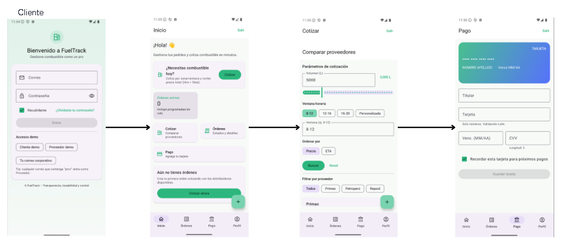
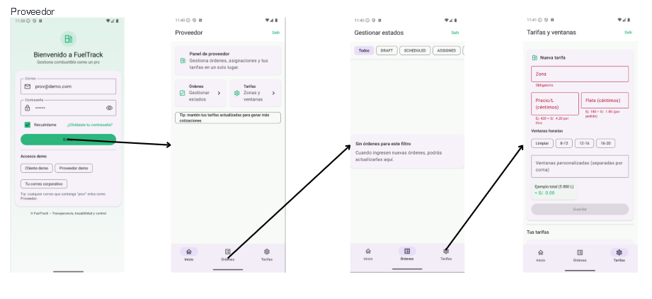

# Capítulo III: Solution UI/UX Design

## 3.1. Product Design
En la realización de este capítulo, abordaremos el diseño integral de la startup, cubriendo aspectos clave como el estilo visual, los diagramas C4 para la arquitectura del sistema, los diagramas de clases y los modelos de base de datos, proporcionando una visión clara y estructurada de la infraestructura y el funcionamiento del proyecto.

---

### 3.1.1. Style Guidelines
En esta sección se presentan los estándares que definen el formato y el diseño de la solución, asegurando la calidad en su implementación.

#### 3.1.1.1. General Style Guidelines
Con estas decisiones en el diseño visual buscamos reflejar innovación que incentive a la formalidad en los procesos de comercialización. Es así como demostramos modernidad y calidad, valores que van alineados a nuestro proyecto.

**Color**  
Seleccionamos esta gama de colores porque armoniza con el diseño del logo y refleja la temática de nuestra aplicación, asegurando la identidad de la marca.

**Tipografía**  
Seleccionamos esta tipografía por su excelente legibilidad en diversos entornos, lo que nos permite diferenciarnos frente a la competencia y aportar una identidad única a nuestra marca.

**Branding**  
El nombre de nuestro producto es *FuelTrack*. Contamos con un logo que representa claramente nuestro rubro, dándole un toque moderno y simple. Además, usamos colores que serán característicos en nuestra empresa y amigables a la vista de nuestros clientes.

---

### 3.1.2. Information Architecture
La arquitectura de información se diseñó para guiar al usuario de forma lógica a través de las funciones esenciales de FuelTrack, facilitando la navegación y reduciendo la curva de aprendizaje.

#### 3.1.2.1. Organization Systems
El sistema de organización de FuelTrack tiene como objetivo facilitar la interacción fluida entre los usuarios (compradores y proveedores) y la plataforma mediante una jerarquía visual clara. Esta jerarquía destaca las funciones clave —como la gestión de pedidos de combustible, el registro de depósitos y la carga de documentos— permitiendo que los usuarios accedan rápidamente a las acciones más importantes desde la pantalla principal.

- **Agrupación lógica de funciones:** Las funcionalidades están organizadas por bloques temáticos (*Record Deposits*, *Upload Documents*, *Track Orders*), lo que permite a los usuarios identificar rápidamente las opciones disponibles y su propósito.  
- **Accesibilidad inmediata:** La interfaz principal resalta las opciones más utilizadas mediante una disposición vertical y centrada, optimizada tanto para escritorio como para dispositivos móviles.  
- **Menú de navegación:** Se mantiene fijo en la parte superior para facilitar el acceso constante a secciones clave como *How it Works*, *Pricing* y *Sign Up*.  
- **Reducción de fricción:** Al minimizar la cantidad de clics necesarios para ejecutar acciones comunes, el sistema organiza la información de forma que prioriza la eficiencia y la experiencia del usuario.  

Este sistema organizativo asegura que tanto usuarios nuevos como recurrentes puedan navegar por FuelTrack con facilidad, incrementando la productividad y reduciendo los errores de operación.

---

#### 3.1.2.2. Labelling Systems
Las etiquetas que utilizaremos para la página serán diseñadas para ser claras, directas y fáciles de entender, enfocándose en la eficiencia y simplicidad para usuarios con distintos niveles de experiencia tecnológica.

---

**Principios generales**
- Se limita el uso de 2-3 palabras por ítem.  
- Se mantiene la consistencia terminológica en todas las pantallas.  
- Las etiquetas son descriptivas y responden a acciones directas, estados o categorías claras.  

---

**Algunas de las etiquetas principales de nuestras secciones serán las siguientes:**

**Gestión de Pedidos**
- Nuevo Pedido  
- Estado de Pedido  
- Historial de Pedidos  
- Ver Detalles  
- Confirmar Entrega  

**Pagos y Facturación**
- Métodos de Pago  
- Mis Facturas  
- Resumen de Pagos  
- Confirmar Pago  

**Reportes**
- Reporte de Pedidos  
- Reporte de Pagos  
- Resumen de Actividad  
- Generar Informe  

**Navegación general**
- Inicio  
- Mi Cuenta  
- Soporte  
- Cerrar Sesión  

---

**Asociaciones y agrupaciones**
- Las etiquetas se agrupan en módulos lógicos (por ejemplo: pedidos, pagos, reportes) con un menú lateral y dashboard central de fácil acceso.  
- Las acciones están asociadas a sus contextos inmediatos: por ejemplo, *Nuevo Pedido* solo aparece cuando se selecciona la opción *Gestión de Pedidos*.  
- Los mensajes del sistema son claros y directos: *Pedido Confirmado*, *Pago Realizado*, *Entrega Programada*.  

Estas etiquetas están diseñadas para que los usuarios puedan navegar de manera sencilla y sin confusiones, optimizando la experiencia para empresas que desean una solución eficiente y fácil de usar.

---

#### 3.1.2.3. SEO Tags and Meta Tags

**Landing Page**
- **Title (SEO Tag):** FuelTrack | Simplify Fuel Order Management  
- **Description (Meta Tag):** Optimize your fuel ordering process with FuelTrack — a centralized platform for buyers and suppliers to record deposits, upload documents, and track orders.  
- **Keywords (Meta Tag):** Fuel, Track, Ordering, Fuel management, Supplier platform, Track fuel orders, Fuel deposits, Order management software  
- **Author (Meta Tag):** FuelTrack Team  

**Web Application**
- **Title (SEO Tag):** FuelTrack | Manage Fuel Orders and Deposits  
- **Description (Meta Tag):** Access your dashboard to record deposits, manage documents, and monitor fuel order status in real time.  
- **Keywords (Meta Tag):** Fuel order tracking, Deposit management, Supplier dashboard, Fuel logistics, FuelTrack Web App  
- **Author (Meta Tag):** FuelTrack Team  

---

#### 3.1.2.4. Searching Systems
Para garantizar una navegación fluida y centrada de nuestra plataforma, vamos a implementar las siguientes acciones y técnicas tanto para la página como la aplicación web:

- **Menú de navegación:** En la página utilizaremos un *Navigation Bar* que contendrá enlaces visibles a las secciones más importantes de la plataforma, principalmente sus características y el registro o ingreso de la cuenta.  
- **Navegación visual guiada:** El contenido está organizado en bloques visuales de las secciones determinadas en la barra principal, permitiendo al usuario desplazarse verticalmente para descubrir las funcionalidades de manera fluida.  
- **Responsive design:** Esta será construida para adaptarse al tipo de dispositivo del usuario. Por ejemplo, la resolución de la página estará optimizada según cómo sea redimensionada, con compatibilidad tanto en escritorio como en portátiles. De esta forma, los usuarios podrán realizar sus tareas sin que el cambio de máquina sea un problema.

---

#### 3.1.2.5. Navigation Systems
Para la plataforma implementamos un sistema de búsqueda por texto y por categorías para que los usuarios, especialmente los proveedores, puedan localizar los pedidos que se han realizado o se están llevando a cabo. Se incluirán filtros de la siguiente manera:

- **Búsqueda por texto:**  
  El usuario tendrá una tabla de pedidos donde en cada categoría (razón social, número de pedido, nombre de banco, etc.) dispondrá de un mini buscador estándar para encontrar sus pedidos registrados o pendientes. Este entregará los resultados según el tipo de información que detecte automáticamente.  
  Además, habrá un botón llamado **“Búsqueda avanzada”**, donde se realizará una búsqueda más específica siempre y cuando se completen todas las categorías.

- **Búsqueda por categorías:**  
  El usuario dispondrá de un sistema automático de filtrado de datos basado en las categorías existentes para optimizar su tiempo en tareas de mayor importancia.  
  Por ejemplo, el sistema se encargará de filtrar todas las ubicaciones detectadas de los pedidos registrados o pendientes, y se podrán seleccionar las que se deseen aplicar.

### 3.1.3. Landing Page UI Design
La propuesta de diseño de la Landing Page para FuelTrack parte de una arquitectura de información clara y orientada a los segmentos objetivo definidos: empresas proveedoras de combustible y empresas solicitantes de combustible.

El diseño organiza el contenido en bloques visuales jerárquicos que guían al usuario de manera natural hacia los principales call-to-action (CTA), alineando cada sección con una necesidad identificada: informar, atraer y convertir.

Decisiones principales de diseño tomadas:

- **Navegación simple y consistente:** El menú principal permite acceso rápido a las secciones clave (Features, Pricing y Contact).
- **Call to Action diferenciados:** Hay botones específicos tanto para proveedores como para solicitantes, siguiendo un enfoque de segmentación clara.
- **Diseño inclusivo:** La paleta de colores cumple estándares de contraste para accesibilidad, y los botones tienen tamaños adecuados para pantallas táctiles.
- **Adaptabilidad:** El diseño es responsive, garantizando experiencia de usuario adecuada tanto en desktop como en dispositivos móviles.
- **Consistencia visual:** Se mantiene un diseño limpio y moderno, utilizando colores corporativos azul y verde para reforzar la identidad de FuelTrack.
#### 3.1.3.1. Landing Page Wireframe  

#### 3.1.3.2. Landing Page Mock-up
 
 

### 3.1.4. Mobile Applications UX/UI Design
#### 3.1.4.1. Mobile Applications Wireframes  

#### 3.1.4.2. Mobile Applications Wireflow Diagrams  

#### 3.1.4.3. Mobile Applications Mock-ups

#### 3.1.4.4. Mobile Applications User Flow Diagrams  

#### 3.1.4.5. Mobile Applications Prototyping
